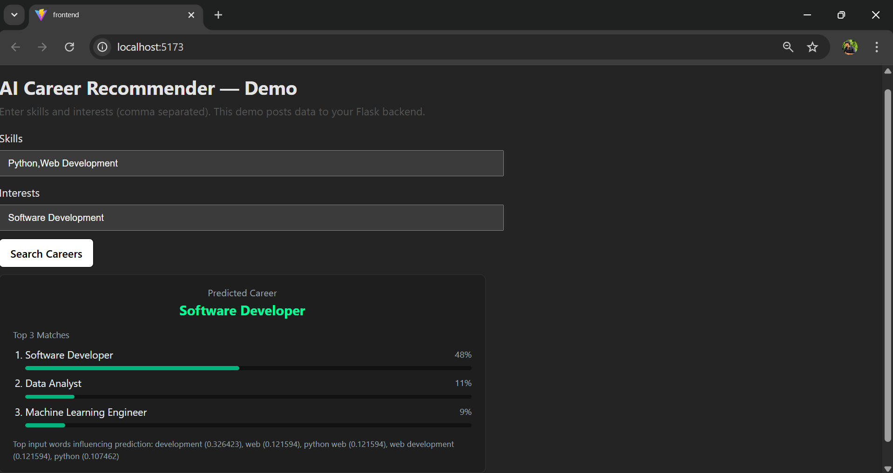

[](LICENSE)
[](https://www.python.org/)
[](https://flask.palletsprojects.com/)
[](#)
[](https://github.com/shagul-hameed-rafiq/ai-career-recommender/commits/main)
[](https://github.com/shagul-hameed-rafiq/ai-career-recommender/actions)

# AI Career Recommender

<p align="center">
  
</p>

*Figure 1 — Demo UI: Enter skills & interests, get top career suggestions.*

---

## 🧠 Overview

A lightweight, full-stack demo built using **Flask**, **React (Vite)**, and **scikit-learn**.  
This AI-driven system predicts suitable **career paths** (e.g., *Software Developer, Data Analyst, ML Engineer*) based on a user’s **skills** and **interests**.

---

## ⚙️ Tech Stack

| Layer | Technology |
|-------|-------------|
| Backend | Flask (Python) |
| Frontend | React (Vite) |
| ML Model | scikit-learn (TF-IDF + Logistic Regression) |
| Dataset | Custom CSV (`backend/data/training.csv`) |
| Deployment | Localhost / GitHub integration ready |

---

## 🚀 Quick Start (Development)

### 🔹 Backend
```bash
cd backend
# create & activate venv (Windows PowerShell)
python -m venv .venv
.\.venv\Scripts\Activate.ps1

# install dependencies
pip install -r requirements.txt

# train model and run server
python train_model.py    # creates model/career_pipeline.pkl
python app.py            # runs backend on http://127.0.0.1:5000


cd frontend
npm install
npm run dev              # runs on http://localhost:5173
