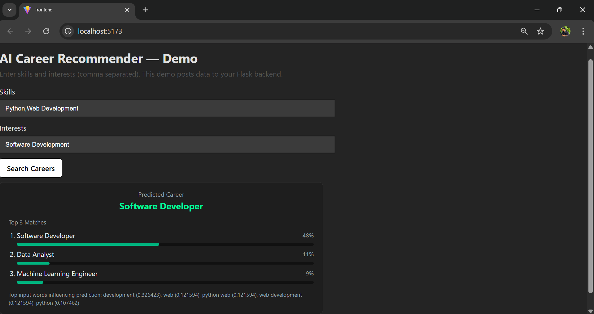

[](LICENSE)
[](https://www.python.org/)
[](https://flask.palletsprojects.com/)
[](#)
[](https://github.com/shagul-hameed-rafiq/ai-career-recommender/commits/main)
[](https://github.com/shagul-hameed-rafiq/ai-career-recommender/actions)

# AI Career Recommender

<p align="center">
  
</p>

*Figure 1 — Demo UI: Enter skills & interests, get top career suggestions.*

---

## 🧠 Overview

A lightweight, full-stack application built using **Flask**, **React (Vite)**, and **scikit-learn**.

This AI-driven system predicts suitable **career paths** (e.g., Software Developer, Data Analyst, ML Engineer) based on a user’s **skills** and **interests**.

The project demonstrates end-to-end integration of a machine learning model with a REST API and modern frontend interface.

---

## ⚙️ Tech Stack

| Layer | Technology |
|-------|-------------|
| Backend | Flask (Python) |
| Frontend | React (Vite) |
| ML Model | scikit-learn (TF-IDF + Logistic Regression) |
| Dataset | Custom CSV (`backend/data/training.csv`) |
| Model Serialization | joblib |
| Deployment | Localhost (CI-ready via GitHub Actions) |

---

## 🏗 System Architecture

1. User inputs skills and interests in the React frontend.
2. Frontend sends a POST request to the Flask backend.
3. Backend transforms text using TF-IDF vectorizer.
4. Logistic Regression model predicts the most suitable career category.
5. API returns structured JSON response.
6. Frontend dynamically renders the recommended career.

---

## 🚀 Quick Start (Development Setup)

### 🔹 Backend Setup

```bash
cd backend
python -m venv .venv
.\.venv\Scripts\Activate.ps1        # Windows
pip install -r requirements.txt

python train_model.py               # trains model & creates model/career_pipeline.pkl
python app.py                       # runs backend at http://127.0.0.1:5000
